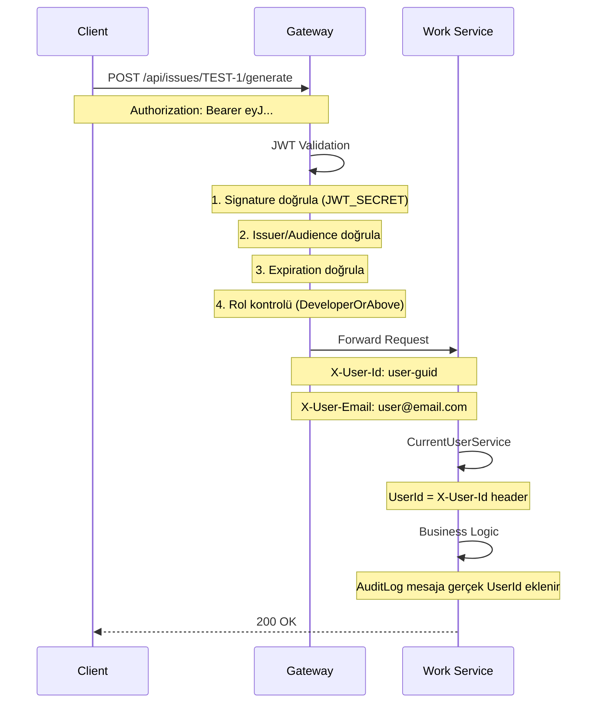

# 🔐 ForgeFlow Gateway & Identity Entegrasyonu

Bu dokümantasyon, Gateway'in çalışma mantığını ve Identity Service entegrasyonunu detaylı açıklar.

---

## 📊 Sistem Mimarisi

```
┌─────────────┐     ┌─────────────────────────────────────────┐     ┌──────────────┐
│   Client    │────▶│              GATEWAY (YARP)              │────▶│   Services   │
│  (Browser)  │     │  JWT Validation + Header Transform       │     │ Work/Artifact│
└─────────────┘     └─────────────────────────────────────────┘     └──────────────┘
                                      │
                                      │ Token Üretimi
                                      ▼
                             ┌─────────────────┐
                             │ Identity Service │
                             │  (JWT + Roles)   │
                             └─────────────────┘
```

---

## 🔑 JWT Token Akışı

### 1. Login → Token Üretimi

```
Client → POST /api/auth/login → Gateway → Identity Service
                                              │
                                              ▼
                                      ┌───────────────┐
                                      │ UserManager   │
                                      │ CheckPassword │
                                      └───────────────┘
                                              │
                                              ▼
                                      ┌───────────────┐
                                      │ JwtTokenService│
                                      │ GenerateToken │
                                      └───────────────┘
                                              │
                                              ▼
                        ┌─────────────────────────────────────┐
                        │ JWT Token                           │
                        │ {                                   │
                        │   "sub": "user-guid",               │
                        │   "email": "user@forgeflow.com",    │
                        │   "fullName": "Ali Eren",           │
                        │   "role": ["Developer", "TeamLead"],│
                        │   "exp": 1737171600                 │
                        │ }                                   │
                        └─────────────────────────────────────┘
```

### 2. Korumalı Endpoint'e Erişim



---

## ⚙️ Gateway Konfigürasyonu

### Program.cs - JWT Authentication

```csharp
// 1. JWT Secret - Ortam değişkeninden (ASLA appsettings'te tutma!)
var jwtSecret = Environment.GetEnvironmentVariable("JWT_SECRET");

// 2. JWT Bearer Authentication
builder.Services.AddAuthentication(JwtBearerDefaults.AuthenticationScheme)
    .AddJwtBearer(options =>
    {
        options.TokenValidationParameters = new TokenValidationParameters
        {
            ValidateIssuer = true,           // Token kimin ürettiğini doğrula
            ValidateAudience = true,         // Token kime yönelik doğrula
            ValidateLifetime = true,         // Süre dolmuş mu?
            ValidateIssuerSigningKey = true, // İmza geçerli mi? (EN ÖNEMLİ!)
            ClockSkew = TimeSpan.Zero        // Saat farkı toleransı yok
        };
    });

// 3. Authorization Policies
builder.Services.AddAuthorization(options =>
{
    options.AddPolicy("Authenticated", p => p.RequireAuthenticatedUser());
    options.AddPolicy("AdminOnly", p => p.RequireRole("Admin"));
    options.AddPolicy("DeveloperOrAbove", p => p.RequireRole("Admin", "TeamLead", "Developer"));
});
```

### appsettings.json - YARP Routes

```json
{
  "ReverseProxy": {
    "Routes": {
      "identity_auth": {
        "ClusterId": "identity",
        "Match": { "Path": "/api/auth/{**catch-all}" }
        // AllowAnonymous: Login/Register için auth gerekmiyor
      },
      "work": {
        "ClusterId": "work",
        "Match": { "Path": "/api/issues/{**catch-all}" },
        "AuthorizationPolicy": "DeveloperOrAbove",
        "Transforms": [
          { "RequestHeader": "X-User-Id", "Set": "{claim:sub}" },
          { "RequestHeader": "X-User-Email", "Set": "{claim:email}" }
        ]
      }
    }
  }
}
```

---

## 🔄 UserId Propagation Akışı

```
JWT Token                  Gateway                    Work Service
    │                         │                            │
    │  ┌──────────────────┐   │                            │
    │  │ claims:          │   │                            │
    │  │   sub: "abc-123" │   │                            │
    │  │   email: "..."   │   │                            │
    │  └──────────────────┘   │                            │
    │                         │                            │
    │        Token ──────────▶│                            │
    │                         │                            │
    │                         │  ┌────────────────────┐    │
    │                         │  │ JWT Validation     │    │
    │                         │  │ Extract Claims     │    │
    │                         │  └────────────────────┘    │
    │                         │                            │
    │                         │  ┌────────────────────┐    │
    │                         │  │ YARP Transform:    │    │
    │                         │  │ X-User-Id=abc-123  │    │
    │                         │  └────────────────────┘    │
    │                         │                            │
    │                         │ ─────────Request──────────▶│
    │                         │ Headers:                   │
    │                         │   X-User-Id: abc-123       │
    │                         │   X-User-Email: ...        │
    │                         │                            │
    │                         │            ┌───────────────┤
    │                         │            │CurrentUserSvc │
    │                         │            │UserId=abc-123 │
    │                         │            └───────────────┤
```

---

## 📋 Route Authorization Matrix

| Route Pattern | Policy | Gerekli Roller | Header Transform |
|---------------|--------|---------------|------------------|
| `/api/auth/*` | Anonymous | - | ❌ |
| `/api/roles/*` | AdminOnly | Admin | ✅ X-User-Id |
| `/api/users/*` | Authenticated | Herhangi | ✅ X-User-Id |
| `/api/issues/*` | DeveloperOrAbove | Admin, TeamLead, Developer | ✅ X-User-Id |
| `/api/artifacts/*` | Authenticated | Herhangi | ✅ X-User-Id |

---

## 🧪 Test Senaryoları

### 1. Token Olmadan → 401
```bash
curl -X POST http://localhost:8090/api/issues/TEST-1/generate
# Expected: 401 Unauthorized
```

### 2. Geçersiz Token → 401
```bash
curl -X POST http://localhost:8090/api/issues/TEST-1/generate \
  -H "Authorization: Bearer invalid-token"
# Expected: 401 Unauthorized
```

### 3. Viewer Rolü ile issues → 403
```bash
# Viewer rolüne sahip kullanıcı login olur
# Token alır
curl -X POST http://localhost:8090/api/issues/TEST-1/generate \
  -H "Authorization: Bearer $TOKEN"
# Expected: 403 Forbidden (Viewer, DeveloperOrAbove policy'i karşılamaz)
```

### 4. Developer Rolü ile issues → 200
```bash
# Developer rolüne sahip kullanıcı login olur
curl -X POST http://localhost:8090/api/issues/TEST-1/generate \
  -H "Authorization: Bearer $TOKEN"
# Expected: 200 OK
# AuditLog'da gerçek UserId görünür
```

---

## 🏗️ Clean Architecture Uyumu

```
┌─────────────────────────────────────────────────────────────────┐
│                         Presentation                             │
│  ┌─────────────┐  ┌─────────────┐  ┌─────────────────────────┐  │
│  │  Gateway    │  │ AuthController│ │ IssuesController        │  │
│  │  (YARP)     │  │             │  │ Only IMediator +         │  │
│  │             │  │             │  │ ICurrentUserService      │  │
│  └─────────────┘  └─────────────┘  └─────────────────────────┘  │
│         │                │                     │                 │
└─────────┼────────────────┼─────────────────────┼─────────────────┘
          │                │                     │
          ▼                ▼                     ▼
┌─────────────────────────────────────────────────────────────────┐
│                         Application                              │
│  ┌─────────────────┐  ┌──────────────────┐  ┌────────────────┐  │
│  │ LoginCommand    │  │ RegisterCommand  │  │ GetRolesQuery  │  │
│  │ RefreshTokenCmd │  │ AssignRoleCmd    │  │ GetUserRolesQ  │  │
│  └─────────────────┘  └──────────────────┘  └────────────────┘  │
│           │                    │                     │          │
└───────────┼────────────────────┼─────────────────────┼──────────┘
            │                    │                     │
            ▼                    ▼                     ▼
┌─────────────────────────────────────────────────────────────────┐
│                       Infrastructure                             │
│  ┌─────────────────┐  ┌──────────────────┐  ┌────────────────┐  │
│  │ JwtTokenService │  │ IdentityDbContext│  │ IdentitySeeder │  │
│  │ (JWT üretimi)   │  │ (EF Core)        │  │ (default data) │  │
│  └─────────────────┘  └──────────────────┘  └────────────────┘  │
└─────────────────────────────────────────────────────────────────┘
```

---

## 🔒 Güvenlik Best Practices

| Pratik | Durum | Açıklama |
|--------|-------|----------|
| JWT Secret .env'de | ✅ | Asla appsettings'te tutma |
| Password Policy | ✅ | ASP.NET Core Identity |
| Token Süre | ✅ | 60 dakika |
| Refresh Token | ✅ | 7 gün, rotation |
| HTTPS | ⚠️ | Production'da aktif edilmeli |
| Rate Limiting | ❌ | İleride eklenebilir |

---

## 📁 Oluşturulan Dosyalar

### Identity Service
- `Domain/Entities/ApplicationUser.cs`
- `Domain/Entities/ApplicationRole.cs`
- `Domain/Entities/RefreshToken.cs`
- `Application/Auth/Commands/*`
- `Application/Roles/Commands/*`
- `Application/Roles/Queries/*`
- `Infrastructure/Persistence/IdentityDbContext.cs`
- `Infrastructure/Services/JwtTokenService.cs`
- `Infrastructure/Services/IdentitySeeder.cs`
- `Api/Controllers/AuthController.cs`
- `Api/Controllers/RolesController.cs`

### Gateway
- `Program.cs` (JWT + Authorization)
- `appsettings.json` (YARP routes + policies)

### Work Service
- `Services/CurrentUserService.cs`
- `Controllers/IssuesController.cs` (updated)
