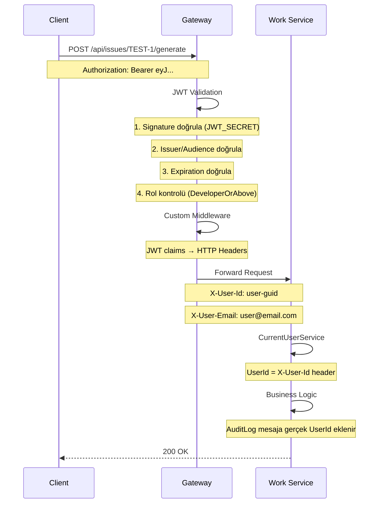

# 🔐 ForgeFlow Gateway & Identity Entegrasyonu

Bu dokümantasyon, Gateway'in çalışma mantığını ve Identity Service entegrasyonunu detaylı açıklar.

---

## 📊 Sistem Mimarisi

```
┌─────────────┐     ┌─────────────────────────────────────────┐     ┌──────────────┐
│   Client    │────▶│              GATEWAY (YARP)              │────▶│   Services   │
│  (Browser)  │     │  JWT Validation + Middleware Transform   │     │ Work/Artifact│
└─────────────┘     └─────────────────────────────────────────┘     └──────────────┘
                                      │
                                      │ Token Üretimi
                                      ▼
                             ┌─────────────────┐
                             │ Identity Service │
                             │  (JWT + Roles)   │
                             └─────────────────┘
```

---

## 🔑 JWT Token Akışı

### 1. Login → Token Üretimi

```
Client → POST /api/auth/login → Gateway → Identity Service
                                              │
                                              ▼
                                      ┌───────────────┐
                                      │ UserManager   │
                                      │ CheckPassword │
                                      └───────────────┘
                                              │
                                              ▼
                                      ┌───────────────┐
                                      │ JwtTokenService│
                                      │ GenerateToken │
                                      └───────────────┘
                                              │
                                              ▼
                        ┌─────────────────────────────────────┐
                        │ JWT Token                           │
                        │ {                                   │
                        │   "sub": "user-guid",               │
                        │   "email": "user@forgeflow.com",    │
                        │   "fullName": "Ali Eren",           │
                        │   "role": ["Developer", "TeamLead"],│
                        │   "exp": 1737171600                 │
                        │ }                                   │
                        └─────────────────────────────────────┘
```

### 2. Korumalı Endpoint'e Erişim



---

## ⚙️ Gateway Konfigürasyonu

### Program.cs - JWT Authentication + Custom Middleware

```csharp
// 1. JWT Secret - Ortam değişkeninden (ASLA appsettings'te tutma!)
var jwtSecret = Environment.GetEnvironmentVariable("JWT_SECRET");

// 2. JWT Bearer Authentication
builder.Services.AddAuthentication(JwtBearerDefaults.AuthenticationScheme)
    .AddJwtBearer(options =>
    {
        // ⚠️ ÖNEMLİ: Claim mapping'i devre dışı bırak!
        // ASP.NET Core varsayılan olarak "sub" → "nameidentifier" dönüşümü yapar
        // Bu satır olmadan middleware "sub" claim'ini bulamaz
        options.MapInboundClaims = false;
        
        options.TokenValidationParameters = new TokenValidationParameters
        {
            ValidateIssuer = true,           // Token kimin ürettiğini doğrula
            ValidateAudience = true,         // Token kime yönelik doğrula
            ValidateLifetime = true,         // Süre dolmuş mu?
            ValidateIssuerSigningKey = true, // İmza geçerli mi? (EN ÖNEMLİ!)
            ClockSkew = TimeSpan.Zero        // Saat farkı toleransı yok
        };
    });

// 3. Authorization Policies
builder.Services.AddAuthorization(options =>
{
    options.AddPolicy("Authenticated", p => p.RequireAuthenticatedUser());
    options.AddPolicy("AdminOnly", p => p.RequireRole("Admin"));
    options.AddPolicy("DeveloperOrAbove", p => p.RequireRole("Admin", "TeamLead", "Developer"));
});

// 4. Middleware Pipeline
app.UseAuthentication();
app.UseAuthorization();

// 5. Custom Middleware: JWT claims → HTTP headers
// ⚠️ YARP {claim:sub} syntax çalışmadı, bu yüzden manuel middleware kullanıyoruz
app.Use(async (context, next) =>
{
    if (context.User.Identity?.IsAuthenticated == true)
    {
        var userId = context.User.FindFirst("sub")?.Value;
        var email = context.User.FindFirst("email")?.Value;
        
        if (!string.IsNullOrEmpty(userId))
            context.Request.Headers["X-User-Id"] = userId;
        
        if (!string.IsNullOrEmpty(email))
            context.Request.Headers["X-User-Email"] = email;
    }
    await next();
});

app.MapReverseProxy();
```

### appsettings.json - YARP Routes (Sadece Authorization)

> **Not:** YARP `{claim:sub}` transform syntax'ı çalışmadığı için header injection'ı middleware ile yapıyoruz.

```json
{
  "ReverseProxy": {
    "Routes": {
      "identity_auth": {
        "ClusterId": "identity",
        "Match": { "Path": "/api/auth/{**catch-all}" }
      },
      "identity_roles": {
        "ClusterId": "identity",
        "Match": { "Path": "/api/roles/{**catch-all}" },
        "AuthorizationPolicy": "AdminOnly"
      },
      "work": {
        "ClusterId": "work",
        "Match": { "Path": "/api/issues/{**catch-all}" },
        "AuthorizationPolicy": "DeveloperOrAbove"
      },
      "artifact": {
        "ClusterId": "artifact",
        "Match": { "Path": "/api/artifacts/{**catch-all}" },
        "AuthorizationPolicy": "Authenticated"
      }
    }
  }
}
```

---

## 🔄 UserId Propagation Akışı

```
JWT Token                  Gateway                    Work Service
    │                         │                            │
    │  ┌──────────────────┐   │                            │
    │  │ claims:          │   │                            │
    │  │   sub: "abc-123" │   │                            │
    │  │   email: "..."   │   │                            │
    │  └──────────────────┘   │                            │
    │                         │                            │
    │        Token ──────────▶│                            │
    │                         │                            │
    │                         │  ┌────────────────────┐    │
    │                         │  │ JWT Validation     │    │
    │                         │  │ MapInboundClaims   │    │
    │                         │  │ = false            │    │
    │                         │  └────────────────────┘    │
    │                         │                            │
    │                         │  ┌────────────────────┐    │
    │                         │  │ Custom Middleware  │    │
    │                         │  │ X-User-Id=abc-123  │    │
    │                         │  └────────────────────┘    │
    │                         │                            │
    │                         │ ─────────Request──────────▶│
    │                         │ Headers:                   │
    │                         │   X-User-Id: abc-123       │
    │                         │   X-User-Email: ...        │
    │                         │                            │
    │                         │            ┌───────────────┤
    │                         │            │CurrentUserSvc │
    │                         │            │UserId=abc-123 │
    │                         │            └───────────────┤
```

---

## 📋 Route Authorization Matrix

| Route Pattern | Policy | Gerekli Roller | Header Transform |
|---------------|--------|---------------|------------------|
| `/api/auth/*` | Anonymous | - | ❌ |
| `/api/roles/*` | AdminOnly | Admin | ✅ Middleware |
| `/api/users/*` | Authenticated | Herhangi | ✅ Middleware |
| `/api/issues/*` | DeveloperOrAbove | Admin, TeamLead, Developer | ✅ Middleware |
| `/api/artifacts/*` | Authenticated | Herhangi | ✅ Middleware |

---

## 🧪 Test Senaryoları

### 1. Token Olmadan → 401
```bash
curl -X POST http://localhost:8090/api/issues/TEST-1/generate
# Expected: 401 Unauthorized
```

### 2. Geçersiz Token → 401
```bash
curl -X POST http://localhost:8090/api/issues/TEST-1/generate \
  -H "Authorization: Bearer invalid-token"
# Expected: 401 Unauthorized
```

### 3. Viewer Rolü ile issues → 403
```bash
# Viewer rolüne sahip kullanıcı login olur
curl -X POST http://localhost:8090/api/issues/TEST-1/generate \
  -H "Authorization: Bearer $TOKEN"
# Expected: 403 Forbidden (Viewer, DeveloperOrAbove policy'i karşılamaz)
```

### 4. Developer Rolü ile issues → 200
```bash
# Developer rolüne sahip kullanıcı login olur
curl -X POST http://localhost:8090/api/issues/TEST-1/generate \
  -H "Authorization: Bearer $TOKEN"
# Expected: 200 OK
# Response: {"correlationId":"...","issueId":"TEST-1","userId":"e0484f28-..."}
```

---

## 📁 Yapılan Değişiklikler (Detaylı)

### 🔷 Identity Service

#### Yeni Dosyalar

| Dosya | Açıklama |
|-------|----------|
| `Domain/Entities/ApplicationUser.cs` | IdentityUser'dan türetilmiş, FullName, EmailVerifiedAt, CreatedAtUtc alanları |
| `Domain/Entities/ApplicationRole.cs` | IdentityRole'dan türetilmiş, Description, IsSystem, CreatedAtUtc alanları |
| `Domain/Entities/RefreshToken.cs` | JWT refresh token entity'si |
| `Application/Auth/Commands/RegisterCommand.cs` | Kullanıcı kayıt komutu |
| `Application/Auth/Commands/RegisterHandler.cs` | Kayıt işleyicisi |
| `Application/Auth/Commands/LoginCommand.cs` | Giriş komutu |
| `Application/Auth/Commands/LoginHandler.cs` | Giriş işleyicisi (roller dahil token) |
| `Application/Auth/Commands/RefreshTokenCommand.cs` | Token yenileme komutu |
| `Application/Auth/Commands/RefreshTokenHandler.cs` | Token yenileme işleyicisi |
| `Application/Roles/Commands/AssignRoleCommand.cs` | Rol atama komutu |
| `Application/Roles/Commands/AssignRoleHandler.cs` | Rol atama işleyicisi |
| `Application/Roles/Commands/RemoveRoleCommand.cs` | Rol kaldırma komutu |
| `Application/Roles/Commands/RemoveRoleHandler.cs` | Rol kaldırma işleyicisi |
| `Application/Roles/Queries/GetRolesQuery.cs` | Tüm rolleri listele |
| `Application/Roles/Queries/GetRolesHandler.cs` | Rol listesi işleyicisi |
| `Application/Roles/Queries/GetUserRolesQuery.cs` | Kullanıcı rollerini al |
| `Application/Roles/Queries/GetUserRolesHandler.cs` | Kullanıcı rolleri işleyicisi |
| `Application/Abstractions/ITokenService.cs` | Token servisi arayüzü |
| `Infrastructure/Persistence/IdentityDbContext.cs` | EF Core DbContext |
| `Infrastructure/Services/JwtTokenService.cs` | JWT token üretimi (roller dahil) |
| `Infrastructure/Services/IdentitySeeder.cs` | Varsayılan roller + admin kullanıcı |
| `Infrastructure/DependencyInjection.cs` | Servis kayıtları |
| `Api/Controllers/AuthController.cs` | Register, Login, Refresh endpoints |
| `Api/Controllers/RolesController.cs` | Rol yönetimi (sadece MediatR) |
| `Api/DesignTimeDbContextFactory.cs` | EF Core migration factory |

#### Varsayılan Roller (IdentitySeeder)

| Rol | IsSystem | Açıklama |
|-----|----------|----------|
| Admin | ✅ | Sistem yöneticisi |
| TeamLead | ✅ | Takım lideri |
| Developer | ✅ | Geliştirici |
| Viewer | ✅ | Salt okunur erişim |

#### Varsayılan Admin Kullanıcı

- **Email:** admin@forgeflow.com
- **Password:** Admin123!
- **Rol:** Admin

---

### 🔷 Gateway

#### Değiştirilen Dosyalar

| Dosya | Değişiklik |
|-------|------------|
| `Program.cs` | JWT authentication, authorization policies, **custom middleware** |
| `appsettings.json` | YARP routes + authorization policies (**transform kaldırıldı**) |
| `ForgeFlow.Gateway.csproj` | `Microsoft.AspNetCore.Authentication.JwtBearer` paketi eklendi |

#### Kritik Değişiklikler

```diff
// Program.cs
+ options.MapInboundClaims = false; // Claim mapping devre dışı

+ // Custom Middleware - YARP {claim:sub} çalışmadı
+ app.Use(async (context, next) =>
+ {
+     if (context.User.Identity?.IsAuthenticated == true)
+     {
+         var userId = context.User.FindFirst("sub")?.Value;
+         context.Request.Headers["X-User-Id"] = userId;
+     }
+     await next();
+ });
```

```diff
// appsettings.json - YARP Routes
  "work": {
    "ClusterId": "work",
    "Match": { "Path": "/api/issues/{**catch-all}" },
    "AuthorizationPolicy": "DeveloperOrAbove"
-   "Transforms": [
-     { "RequestHeader": "X-User-Id", "Set": "{claim:sub}" }
-   ]
  }
```

---

### 🔷 Work Service

#### Yeni Dosyalar

| Dosya | Açıklama |
|-------|----------|
| `Services/CurrentUserService.cs` | X-User-Id header'ından UserId okur |

#### Değiştirilen Dosyalar

| Dosya | Değişiklik |
|-------|------------|
| `Controllers/IssuesController.cs` | ICurrentUserService inject, placeholder UserId kaldırıldı |
| `Program.cs` | HttpContextAccessor + CurrentUserService registration |

#### CurrentUserService

```csharp
public class CurrentUserService : ICurrentUserService
{
    private readonly IHttpContextAccessor _httpContextAccessor;

    public string? UserId => 
        _httpContextAccessor.HttpContext?.Request.Headers["X-User-Id"].FirstOrDefault();

    public string? Email => 
        _httpContextAccessor.HttpContext?.Request.Headers["X-User-Email"].FirstOrDefault();

    public bool IsAuthenticated => !string.IsNullOrEmpty(UserId);
}
```

---

## 🏗️ Clean Architecture Uyumu

```
┌─────────────────────────────────────────────────────────────────┐
│                         Presentation                             │
│  ┌─────────────┐  ┌─────────────┐  ┌─────────────────────────┐  │
│  │  Gateway    │  │ AuthController│ │ IssuesController        │  │
│  │  (YARP +    │  │             │  │ Only IMediator +         │  │
│  │  Middleware)│  │             │  │ ICurrentUserService      │  │
│  └─────────────┘  └─────────────┘  └─────────────────────────┘  │
└─────────────────────────────────────────────────────────────────┘
                           │
                           ▼
┌─────────────────────────────────────────────────────────────────┐
│                         Application                              │
│  ┌─────────────────┐  ┌──────────────────┐  ┌────────────────┐  │
│  │ LoginCommand    │  │ RegisterCommand  │  │ GetRolesQuery  │  │
│  │ RefreshTokenCmd │  │ AssignRoleCmd    │  │ GetUserRolesQ  │  │
│  └─────────────────┘  └──────────────────┘  └────────────────┘  │
└─────────────────────────────────────────────────────────────────┘
                           │
                           ▼
┌─────────────────────────────────────────────────────────────────┐
│                       Infrastructure                             │
│  ┌─────────────────┐  ┌──────────────────┐  ┌────────────────┐  │
│  │ JwtTokenService │  │ IdentityDbContext│  │ IdentitySeeder │  │
│  │ (JWT üretimi)   │  │ (EF Core)        │  │ (default data) │  │
│  └─────────────────┘  └──────────────────┘  └────────────────┘  │
└─────────────────────────────────────────────────────────────────┘
```

---

## 🔒 Güvenlik Best Practices

| Pratik | Durum | Açıklama |
|--------|-------|----------|
| JWT Secret .env'de | ✅ | Asla appsettings'te tutma |
| MapInboundClaims = false | ✅ | Claim mapping sorunlarını önler |
| Password Policy | ✅ | ASP.NET Core Identity |
| Token Süre | ✅ | 60 dakika |
| Refresh Token | ✅ | 7 gün, rotation |
| HTTPS | ⚠️ | Production'da aktif edilmeli |
| Rate Limiting | ❌ | İleride eklenebilir |

---

## ⚠️ Önemli Notlar

### YARP {claim:sub} Neden Çalışmadı?

YARP'ın JSON config'deki `{claim:sub}` syntax'ı, claim transform'ları için tasarlanmış ama pratikte:
1. `{claim:sub}` literal string olarak geçiyor, parse edilmiyor
2. ASP.NET Core claim mapping sorunu (sub → nameidentifier)

**Çözüm:** Custom middleware ile manuel header injection.

### MapInboundClaims = false Neden Gerekli?

ASP.NET Core JWT handler varsayılan olarak claim'leri dönüştürür:
- `sub` → `http://schemas.xmlsoap.org/ws/2005/05/identity/claims/nameidentifier`
- `email` → `http://schemas.xmlsoap.org/ws/2005/05/identity/claims/emailaddress`

Bu dönüşüm yüzünden `context.User.FindFirst("sub")` null döner. `MapInboundClaims = false` ile bu dönüşüm devre dışı bırakılır.
